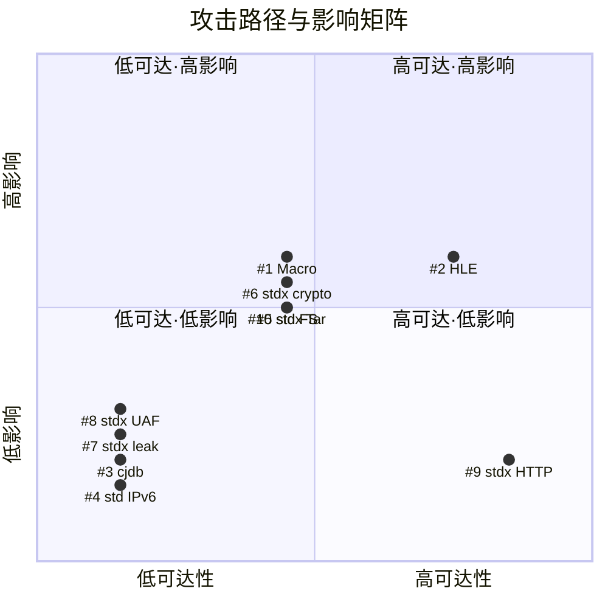

# Cangjie 105.0 版本 ICSL 安全渗透测试问题回溯分析报告

---

## 一、背景与概述

ICSL（华为内网安全实验室）对 Cangjie 105.0 版本开展白盒安全渗透测试，共发现 10 个安全问题，覆盖编译器Macro、HLE 、cjdb、标准库（std）及扩展库（stdx）等模块。所有问题均已由仓颉团队完成修复并合入对应 Pull Request。

本报告聚焦三个方面：检测能力差距分析、测试看护缺口识别、改进措施（5W2H）。

10 个问题按攻击路径分为三类：无攻击路径（4 个）、有攻击路径但需本地权限或高条件（4 个）、有攻击路径且远程可达或需用户交互（2 个）。stdx 模块问题最为集中（5 个）。

---

## 二、问题总览

下表汇总 ICSL 本次渗透测试发现的 10 个安全问题。

**表1　ICSL 渗透测试发现问题一览表**

| 编号 | 模块 | 问题简述 | 攻击路径分类 |
|------|------|----------|-------------|
| 1 | Macro | FlatBuffers Verifier 缺失，LSP 宏服务器 IPC 消息未校验 | 有路径·需本地权限 |
| 2 | HLE | 注释闭合突破注入，恶意 .d.ts 可注入可执行代码 | 有路径·需用户交互 |
| 3 | cjdb | int8_t 循环变量溢出导致无限循环和越界读取 | 无攻击路径 |
| 4 | std | IPv6 字面量解析器未兼容 RFC 4291 允许的格式 | 无攻击路径 |
| 5 | std | CJ_FS_OpenFile 符号链接跟随（TOCTOU 竞态） | 有路径·需本地权限 |
| 6 | stdx | crypto/keys 加密路径密码未清零，堆内存残留 | 有路径·需本地权限 |
| 7 | stdx | crypto/keys PKCS8 加密路径 algorithm 对象泄漏 | 无攻击路径 |
| 8 | stdx | crypto/digest SM3 失败路径悬空指针导致二次释放 | 无攻击路径 |
| 9 | stdx | HTTP/1.1 chunked 请求体绕过配置的请求大小限制（1:1攻击） | 有路径·远程可达 |
| 10 | stdx | Tar 解压经父级符号链接删除目标目录之外的文件 | 有路径·需本地权限 |

---

## 三、攻击路径分类分析

### 3.1　攻击路径与影响矩阵

以攻击路径可达性为横轴、潜在影响程度为纵轴，呈现 10 个问题的分布矩阵。

> 注：#9 HTTP chunked 绕过大小限制属于 1:1 攻击，攻击者需付出与服务器相当的资源成本，攻击价值低，影响程度评定为"低"。

按照攻击路径的可达性和利用条件，将 10 个问题分为以下三类。

### 3.2　A类：无攻击路径（4个）

此类问题不具备可利用的攻击路径，主要为代码质量缺陷、协议兼容性问题或错误路径资源管理缺陷，通常在异常触发条件下导致功能异常或进程崩溃。包括：

- **#3** cjdb int8_t 循环变量溢出：类型不匹配导致有符号/无符号比较异常，触发无限循环和越界读取
- **#4** std IPv6 字面量解析协议不兼容：未按 RFC 4291 实现，错误拒绝合法的 IPv4 嵌入格式
- **#7** stdx PKCS8 加密路径 algorithm 对象泄漏：失败路径未释放 algorithm 对象，造成内存泄漏
- **#8** stdx SM3 失败路径悬空指针二次释放：catch 分支释放 sm3Ctx 后未置空，析构时二次释放导致堆损坏

### 3.3　B类：有攻击路径但需本地权限或高条件（4个）

此类问题存在理论攻击路径，但利用需要本地代码执行权限、对目录结构的感知、竞态条件命中或内存转储能力等较高前提，实际利用难度较大。包括：

- **#1** Macro FlatBuffers Verifier 缺失：需 LSP 模式 + 本地 LD_PRELOAD 注入宏服务器进程，通过 IPC 管道注入恶意 FlatBuffers，攻击价值较小
- **#5** std CJ_FS_OpenFile 符号链接跟随：需本地权限并在 realpath 与 open 的竞态窗口内替换文件为符号链接，无稳定攻击路径
- **#6** stdx crypto 加密路径密码未清零：需通过内存转储（core dump / swap / 堆检查）恢复已释放堆块中的密码字节
- **#10** stdx Tar 解压父级符号链接越界删除：需本地权限感知目录结构，在解压根下预置或竞态植入父级符号链接

### 3.4　C类：有攻击路径且远程可达或需用户交互（2个）

此类问题可通过网络远程触发或通过诱导用户交互触发，攻击面较广。包括：

- **#2** HLE 注释闭合突破注入：需用户使用 HLE 工具处理恶意 .d.ts 文件，注入的代码可自动执行，但 HLE 工具使用场景有限且完整 RCE 链较长
- **#9** stdx HTTP chunked 请求体绕过大小限制：未认证客户端可经 Transfer-Encoding: chunked 流式发送请求体，但属于 **1:1 攻击范畴**——攻击者消耗的带宽/资源与服务器相当，攻击效率低，需大量并发攻击者才能造成显著影响，实际攻击价值低

---

## 四、回溯分析：为什么我们没有发现

ICSL 完全复用我们的三个挖洞 Skills（cangjie-vuln-hunter、audit-lite、Cangjie-compiler-vuln-hunter），模式库、扫描流程、误报排除规则均相同。我们未发现而 ICSL 发现的差异来自四个方面：模型组合与围栏应对、模式库执行效果、问题定级标准、问题探索深度。

### 4.1　模型组合与围栏应对差异

ICSL 未使用特殊工具，与我们的唯一变量是模型组合和围栏应对策略：

| 维度 | 我们 | ICSL |
|------|------|------|
| 主力模型 | GPT 5.5 | GPT 5.6 + GLM 5.1 |
| 尝试模型 | Claude Opus 4.6/4.7/4.8 | — |
| 围栏应对 | Claude 频繁触发围栏，无应对策略 | GPT 5.6 遇围栏，通过越狱突破 |

相同的模式库，模型代码理解能力和分析完整性直接决定模式匹配的执行效果。更强的模型和不受围栏限制的分析能覆盖更多隐蔽形态和异常路径。

### 4.2　模式库匹配情况

三个 Skills 的模式库规模如下：

| Skill | 覆盖范围 | 模式库规模 | 历史审计资产 |
|-------|---------|-----------|-------------|
| cangjie-vuln-hunter | std / stdx 标准库 | 11 大类 28 个通用模式 + 组件特有模式（stdx_net_http 13 个、stdx_net_tls 5 个、stdx_encoding_url 5 个） | 83 份审计报告，217+ 已确认问题，440+ 已驳回误报，8 大类误报排除规则 |
| cangjie-compiler-vuln-hunter | 编译器（cjc/cjdb/macro/parser/codegen 等） | 14 个编译器特定模式（COMP-DESER-001、COMP-FS-002、COMP-PROC-002 等） | 2026年3月编译器审计历史发现 |
| audit-lite | 通用 C/C++ 代码库 | VKB 知识库：11 个 signal_patterns + 7 个 knowledge_cards + fp_catalog | 通用误报目录 |

10 个问题与模式库的匹配分为三类：

**A类：已有对应模式但未检出（5个）** — ICSL 使用相同模式库检出，差异在执行效果（受模型能力影响），而非模式库缺失。

| 问题 | 对应模式 | 模块审计状态 |
|------|---------|------------|
| #9 HTTP chunked 绕过大小限制 | HTTP-002 Chunked Body No Size Limit | stdx_net_http 已完成审计（35 findings），该问题标为非问题 |
| #6 加密路径密码未清零 | INFO-003 Key Material Not Zeroed After Use | stdx_crypto 已完成审计（9个确认问题） |
| #1 Macro FlatBuffers Verifier 缺失 | COMP-DESER-001 deserialization limits disabled or integrity missing | 编译器模块 |
| #5 CJ_FS_OpenFile 符号链接跟随 | MEM-003 TOCTOU in File Operations | std_fs 已完成审计（4个确认问题） |
| #7 PKCS8 加密路径 algorithm 对象泄漏 | MEM-001 Native Code Memory Leak | stdx_crypto 已完成审计（9个确认问题） |

三个已审计模块（stdx_net_http、stdx_crypto、std_fs）均存在已审计但仍漏检的情况。Analyst 阶段最多并行 4 个候选，按严重性降序处理，配备 8 大类误报排除规则。

**B类：模式部分匹配但覆盖范围不足（3个）**

| 问题 | 部分匹配的模式 | 覆盖缺口 |
|------|--------------|---------|
| #3 cjdb int8_t 循环变量溢出 | COMP-NUM-001 integer arithmetic UB or missing zero checks | 未覆盖循环变量类型不匹配（int8_t 与 uint8_t 比较）形态 |
| #8 SM3 失败路径悬空指针二次释放 | MEM-004 Double Free in FFI Code | 模式限定为 FFI 代码，#8 是 Cangjie 析构器中的二次释放，限定过窄 |
| #10 Tar 解压父级符号链接越界删除 | MEM-003 TOCTOU（通用模式部分匹配） | stdx_compress 无路径穿越/符号链接相关的组件特有模式 |

**C类：模式库盲区（2个）**

| 问题 | 盲区原因 |
|------|---------|
| #2 HLE 注释闭合突破注入 | 代码生成工具安全范畴，现有模式库未覆盖工具链代码生成过程中的注入攻击面 |
| #4 IPv6 字面量解析协议不兼容 | 功能正确性问题（未按 RFC 4291 实现），现有攻击模式库不包含协议标准符合性检查 |

### 4.3　问题定级标准差异

部分问题我们内部已发现或评估过，但因定级标准不同判定为非问题，ICSL 判定为问题。

**案例一：#9 HTTP chunked 无大小限制（攻击性价比定级差异）**

| 方 | 1:1 攻击定级 | 1:N 攻击定级 |
|----|-------------|-------------|
| 我们+蓝军 | 非问题（不记录、不修复） | — |
| ICSL | 低危问题 | 严重或致命 |

**案例二：#2 HLE 注释闭合突破注入（责任归属定级差异）**

| 方 | 定级逻辑 | 定级结果 |
|----|---------|---------|
| 我们+蓝军 | 开发者应对工具自动生成的代码负责 | 非问题，甚至不用修复 |
| ICSL | 工具本身应保证生成代码安全性 | 严重问题 |

定级标准差异体现在两个维度：① 攻击性价比定级（1:1 攻击是否算问题）；② 责任归属定级（工具生成代码的安全问题由谁负责）。

### 4.4　问题探索深度差异

防守方与攻击方对问题的探索深度存在差异。以 #2 HLE 注释闭合突破注入为例：

| 方 | 探索深度 | 结论 |
|----|---------|------|
| 我们（防守方） | 确认问题存在，但判断注入的恶意代码不会被主动调用 | 无有效攻击路径 |
| ICSL（攻击方） | 投入较多精力单点探索，发现将恶意代码写入静态构造函数 | 无需主动调用，代码自动执行，攻击路径有效 |

防守方倾向于在常规利用路径下判断问题严重性，攻击方会投入更多精力探索非常规利用路径。这种探索深度差异导致部分问题被防守方判定为"无有效攻击路径"，而攻击方通过深入探索发现了可利用路径。

---

## 五、测试看护分析：为什么没有看护住

现有测试体系在以下方面存在缺口：

- **错误路径/失败路径测试不足**：#7（algorithm 对象泄漏仅在 PKCS8_set0_pbe 失败时触发）、#8（SM3 reset 中 digestInitEx 失败时触发二次释放）均为错误路径问题，需要主动构造失败条件才能触发，现有测试可能仅覆盖正常路径
- **边界条件测试不足**：#3（int8_t 循环变量在 type_arg_num > 127 时溢出）需要构造边界值（128、200、255）才能触发，现有测试可能未覆盖类型上限附近的输入
- **协议兼容性测试不足**：#4（IPv6 解析未兼容 RFC 4291 的 x:x:x:x:x:x:d.d.d.d 格式）需要使用 RFC 一致性测试集，现有测试可能仅覆盖常见格式
- **操作顺序测试不足**：#10（Tar 解压先删除后校验父级路径）需要验证文件操作与路径校验的顺序正确性，现有测试可能未覆盖这种时序逻辑

---

## 六、改进措施（5W2H）

设计以下 2 项系统性改进措施。

### 措施1：升级模型组合与围栏应对策略

**表3　措施1 — 5W2H 分析**

| 维度 | 内容 |
|------|------|
| **What** | 引入 GPT 5.6 及以上版本作为白盒扫描主力模型；制定安全围栏应对策略库 |
| **Why** | 我们使用 GPT 5.5，ICSL 使用 GPT 5.6，模型版本差异客观存在；Claude 因安全围栏在我们的扫描中基本不可用，ICSL 通过越狱突破了 GPT 5.6 的围栏。引入更强模型并建立围栏应对策略是提升扫描检出能力的必要措施 |
| **Who** | 虞嘉豪 |
| **When** | 9.30 |
| **Where** | GPT 5.6 模型接入配置；安全围栏应对策略库文档 |
| **How** | ① 建立围栏触发记录与分析机制，总结高频围栏场景及有效绕过/替代提示词；② 对围栏中断的扫描任务自动降级到备用模型或调整提示词重试；③ 定期评估新模型版本并更新主力模型 |

### 措施2：优化模式库执行检出率与覆盖边界

**表4　措施2 — 5W2H 分析**

| 维度 | 内容 |
|------|------|
| **What** | 优化 Analyst 阶段检出策略，扩展模式覆盖边界，补充模式库盲区 |
| **Why** | 本次 10 个问题中 5 个已有模式但未检出（执行问题）、3 个模式覆盖不足、仅 2 个真正盲区。主要差距在于模式执行检出率不足和覆盖边界过窄，而非缺少模式 |
| **Who** | 虞嘉豪 |
| **When** | 9.10 |
| **Where** | 优化后的挖洞Skills |
| **How** | ① 优化 Analyst 并行策略；② 调整误报排除规则；③ 扩展模式覆盖边界；④ 补充组件特有模式；⑤ 补充模式库盲区；⑥ 增强模式 Code Signature |

> **关于"增强模式 Code Signature"**：Code Signature 是挖洞 Skill 中用于识别特定漏洞模式的代码特征匹配规则。现有特征码主要匹配"完全没有校验/清零/释放"的典型形态，对以下隐蔽形态覆盖不足：① **部分路径校验**（如 #9 仅 Content-Length 分支有大小限制，chunked 分支没有）；② **非对称遗漏**（如 #6 解密路径有 memset_s 清零，加密路径没有）；③ **异常回退路径**（如 #5 正常路径有 realpath 校验，ENOENT 回退路径没有）。增强 Code Signature 即让特征码能识别上述非典型形态。
