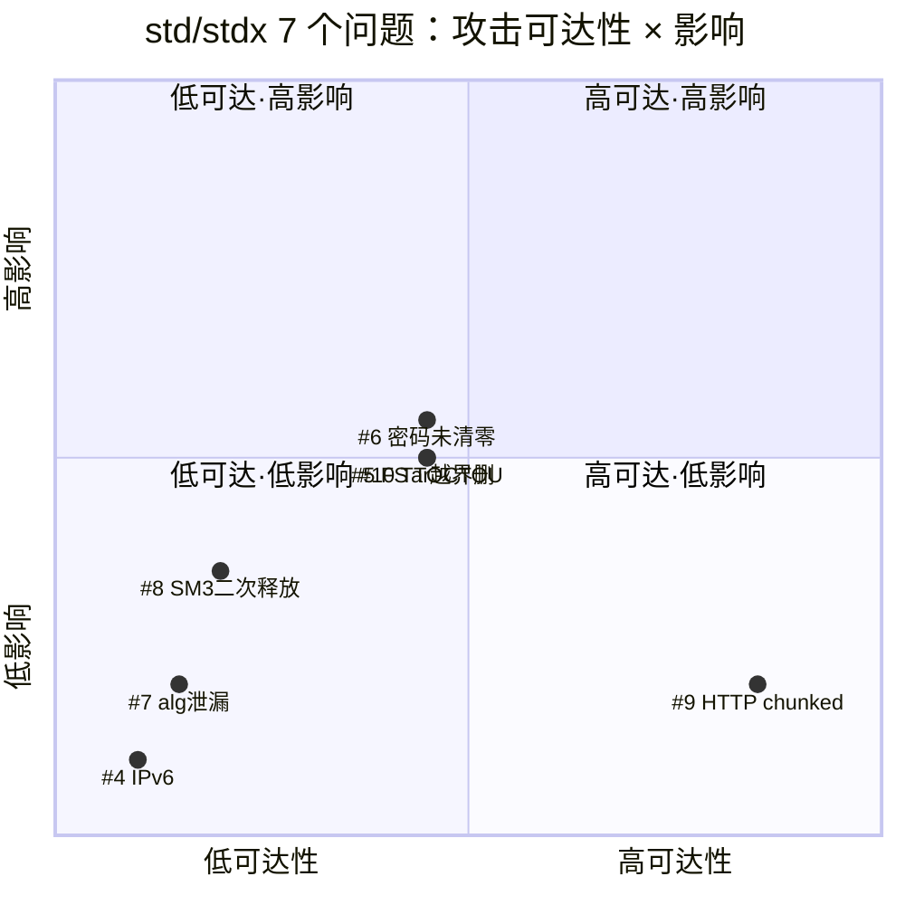

# Cangjie std /stdx 模块 ICSL 发现问题 RCA 报告

> 范围：ICSL 对 Cangjie 105.0 白盒渗透测试发现的 10 个问题中，归属 
>
> **std（标准库）**
>
>  与 
>
> **stdx（扩展库）**
>
>  的 7 个问题（编号 #4–#10）。
> 目标：逐个做根因分析（技术分析 + 修改方案），明确每个问题的"问题控制点"（应在流程哪一环被防住），并给出具体改进措施。
> 原则：均为白盒发现，不回放"问题发生与解决过程"、不做技术根因/引入点分析。


***

## 一、问题总览与攻击路径分类

7 个问题按攻击路径可达性分为三类：


| 类别                      | 编号  | 问题                                 | 模块            | 攻击路径定性                       |
| ----------------------- | --- | ---------------------------------- | ------------- | ---------------------------- |
| **A 类：无攻击路径**           | #4  | IPv6 字面量解析器未兼容 RFC 4291            | std           | 协议符合性缺陷，无安全攻击面               |
|                         | #7  | PKCS8 加密路径 algorithm 对象泄漏          | stdx/crypto   | 失败路径内存泄漏，无直接利用               |
|                         | #8  | SM3 失败路径悬空指针二次释放                   | stdx/crypto   | 需 digestInitEx 失败，理论可演化为堆破坏  |
| **B 类：有路径但需本地权限 / 高条件** | #5  | CJ\_FS\_OpenFile 符号链接跟随（TOCTOU）    | std/fs        | 需本地权限 + realpath→open 竞态窗口命中 |
|                         | #6  | 加密路径密码堆内存未清零                       | stdx/crypto   | 需 core dump /swap/ 堆扫描       |
|                         | #10 | Tar 解压父级符号链接越界删除                   | stdx/compress | 需本地权限感知目录结构 + 预置 / 竞态植入符号链接  |
| **C 类：有路径且远程可达**        | #9  | HTTP chunked 绕过 maxRequestBodySize | stdx/net/http | 未认证远程可达，但属 1:1 攻击，攻击效率低      |

### 1.1 攻击路径 × 影响矩阵（聚焦 std/stdx 7 题）




> 说明：#9 虽为远程可达，但攻击者需以等量带宽 / 连接消耗服务器资源（1:1），攻击效率低，故落在 "高可达・低影响" 象限。#5/#6/#10 均需本地权限或竞态前提，可达性居中、影响中等。


***

## 二、逐题 RCA

> **"是否拦住"列图例**：
> - ✅ 本应在此拦住：这个环节理论上能发现问题，但实际没拦住
> - ⚠️ 部分拦住/部分覆盖：环节存在，但有遗漏（如模式只覆盖主路径、正常路径有校验错误路径没有）
> - ❌ 未拦住：这个环节没覆盖到问题
> - —：与该问题无关

### #4　std：IPv6 字面量解析器协议不兼容（RFC 4291）

**修改方案**


* issue：[cangjie\_runtime#833](https://gitcode.com/Cangjie/cangjie_runtime/issues/833)

* 修复 PR：[cangjie\_runtime#1708](https://gitcode.com/Cangjie/cangjie_runtime/pull/1708)

* 测试 PR：[cangjie\_test#2068](https://gitcode.com/Cangjie/cangjie_test/pull/2068)

**技术分析**


* **现象**：当前 IPv6 解析器错误拒绝 RFC 4291 §2.2 允许的 `x:x:x:x:x:x:d.d.d.d`（6 个 hextet + 末尾嵌入 IPv4）形式，例如 `1:2:3:4:5:6:1.2.3.4`。系统 `inet_pton(AF_INET6, ...)` 接受此形式。

* **根因**：解析器在状态机实现上未覆盖 " 压缩双冒号 `::` 之外、嵌入 IPv4 出现在第 6 段之后 " 的合法分支，把该形态误判为非法输入。

* **性质**：功能正确性 / 协议符合性缺陷，非内存安全问题；无攻击者可控输入链路，不构成安全漏洞，但会导致合法用户连接失败，属兼容性 bug。**本题定性为功能测试缺失**：开发实现时遗漏了 RFC 4291 的合法分支，测试侧也未覆盖该形态，开发与测试均为责任人。

**问题控制点**


| 环节       | 是否拦住         | 责任方    | 说明                                                                                         |
| -------- | ------------ | ------ | ------------------------------------------------------------------------------------------ |
| **功能测试** | ✅ **本应在此拦住** | **测试** | 应把 RFC 4291 规定的全部合法 / 非法写法（含 `x:x:x:x:x:x:d.d.d.d`、`::d.d.d.d`、`::1` 等）列成测试用例逐条验证；实际未覆盖该形态 |
| 静态扫描（含白盒AI扫描）     | ⚠️           | 白盒 AI 逐行对照 RFC 应能发现这种实现偏差，但现有扫洞 Skills 聚焦安全漏洞模式，不做协议符合性检查，所以没覆盖 |

**改进措施**：

- 测试补充：把 RFC 4291 规定的全部合法/非法 IPv6 写法列成测试用例，与系统 `inet_pton` 结果对拍，不一致即 bug。
- 举一反三：用 AI 扫描 std 里其他协议解析模块（URL、HTTP header 等），检查是否有类似"未按 RFC 完整实现"的问题。


***

### #5　std：CJ\_FS\_OpenFile 符号链接跟随（TOCTOU）

**修改方案**


* issue：[cangjie\_runtime#845](https://gitcode.com/Cangjie/cangjie_runtime/issues/845)

* 修复 PR：[cangjie\_runtime#1725](https://gitcode.com/Cangjie/cangjie_runtime/pull/1725)

* 测试 PR：[cangjie\_test#2094](https://gitcode.com/Cangjie/cangjie_test/pull/2094)

* 修复要点：所有 `open()` 调用加 `O_NOFOLLOW`；创建操作使用 `O_CREAT | O_EXCL | O_NOFOLLOW` 原子创建，消除 realpath→open 竞态窗口。

**技术分析**


```c
// stdlib/libs/std/fs/native/file_system_unix.c:700
FsInfo* CJ_FS_OpenFile(const char* path, int32_t openMode) {
    char realPath[PATH_MAX + 1] = {0};
    const char* filePath = realPath;
    if (realpath(path, realPath) == NULL) {
        if (errno != ENOENT) { /* error */ return result; }
        filePath = path;          // ★ ENOENT 回退到原始 path
    }
    int32_t fd = open(filePath, access, DEFFILEMODE);  // ★ 无 O_NOFOLLOW
}
```


* **数据流**：`realpath()` 解析 → 文件不存在（ENOENT）时回退原始 `path` → `open()` 跟随符号链接。

* **攻击链**：攻击者在 `realpath()` 返回 NULL 与 `open()` 之间的竞态窗口内，把 `path` 替换为指向 `/etc/cron.d/payload` 等敏感文件的符号链接 → 应用以自身权限写入 / 覆盖敏感文件。最小利用场景：用户上传文件服务 `File(uploadPath, OpenMode.Write)`。

* **为何 "无稳定攻击路径"**：竞态窗口是毫秒级，需本地权限且攻击者能感知 victim 的上传 / 创建节奏；无法稳定命中。但一旦命中，影响是任意文件覆盖。

**问题控制点**


| 环节          | 是否拦住         | 说明                                                                            |
| ----------- | ------------ | ----------------------------------------------------------------------------- |
| **静态扫描（含白盒AI扫描）**     | ⚠️ 模式已有但未检出 | 模式库 MEM-003 TOCTOU 已覆盖通用形态，但现有 code signature 只看主路径，漏了 ENOENT 回退分支；ICSL 用同样模式库检出，差异在模型执行 |
| 单元 / 集成测试   | ❌            | 现有 fs 测试用真实文件，不模拟竞态；符号链接场景覆盖弱                                                 |

**改进措施**：

- 代码扫描：用 AI 扫描 std/fs 所有 `open`/`openat`/`create` 调用，检查是否有未带 `O_NOFOLLOW` 的，逐个确认是否需要补。
- 测试补充：构造符号链接竞态场景的集成测试。


***

### #6　stdx：crypto/keys 加密路径密码未清零

**修改方案**


* issue：[cangjie\_stdx#366](https://gitcode.com/Cangjie/cangjie_stdx/issues/366)

* 修复 PR：[cangjie\_stdx#782](https://gitcode.com/Cangjie/cangjie_stdx/pull/782)

* 修复要点：在 `EncryptPrivateKey` 返回前（keys.c 约 line 407）对 `password` 缓冲区执行 `memset_s` / `DYN_OPENSSL_cleanse`，与解密路径对齐。

**技术分析**


```cangjie
// keys/keys.cj:382 —— 加密路径
try (passwordCStr = LibC.mallocCString(password).asResource(), ...) {
    cjX509EncryptPrivateKey(keyBytes, passwordCStr.value, ...);
} // asResource() 析构只调 free()，不清零
```


```c
// keys/native/keys.c:284 —— 解密路径（正确，作为对照）
(void)memset_s((void*)params->password, passwordLength, 0, passwordLength);
// keys/native/keys.c:350-409 —— EncryptPrivateKey：使用密码后无 memset_s
```


* **数据流**：用户密码 → `mallocCString` 复制到堆 → C 函数 `EncryptPrivateKey` 用于 PKCS8 加密 → 返回前不清零 → `free()` 释放 → 密码字节残留在已释放堆块。

* **攻击场景**：core dump、swap 换出、堆检查漏洞扫描已释放堆块 → 恢复明文密码。

* **非对称证据**：解密路径**明确**调了 `memset_s`，加密路径**遗漏**—— 同一模块、同一类操作，一有一无，是典型的遗漏 bug 而非设计取舍。

**问题控制点**


| 环节             | 是否拦住         | 说明                                                         |
| -------------- | ------------ | ---------------------------------------------------------- |
| **代码检视**       | ✅ **本应在此拦住** | 同模块解密 / 加密路径并排对比，一眼可见非对称；检视者若熟悉 crypto 模块应能发现              |
| 静态扫描（含白盒AI扫描）           | ⚠️           | 模式库 INFO-003"Key Material Not Zeroed After Use" 已存在，但漏检了本题 |
| 单测             | ❌            | 无法通过正常单测观察 "已释放堆内存是否清零"                                    |

**改进措施**：

- 代码扫描：用 AI 扫描 stdx/crypto 所有处理密钥/密码的堆缓冲区，检查加密/解密、签名/验签等成对路径是否对称清零。


***

### #7　stdx：crypto/keys PKCS8 加密路径 algorithm 对象泄漏

**修改方案**


* issue：[cangjie\_stdx#366](https://gitcode.com/Cangjie/cangjie_stdx/issues/366)

* 修复 PR：[cangjie\_stdx#782](https://gitcode.com/Cangjie/cangjie_stdx/pull/782)

* 修复要点：在 `PKCS8_set0_pbe` 失败的错误分支补 `DYN_X509_ALGOR_free(algorithm, dynMsg)`。

**技术分析**


* **位置**：`EncryptPrivateKey` 中，`algorithm` 对象分配后调用 `PKCS8_set0_pbe`；失败时仅 `p8info` 被释放，`algorithm` 未释放。

* **触发条件**：`PKCS8_set0_pbe` 返回失败（异常路径）。正常路径不泄漏。

* **影响**：单次失败泄漏一个 `X509_ALGOR` 对象；反复失败可造成缓慢内存增长，最终 OOM。无直接代码执行路径。

**问题控制点**


| 环节                | 是否拦住         | 说明                                                        |
| ----------------- | ------------ | --------------------------------------------------------- |
| **代码检视**          | ✅ **本应在此拦住** | "alloc → may fail → free on error" 的成对逻辑是检视重点             |
| 静态扫描（含白盒AI扫描）              | ⚠️           | 模式库 MEM-001 Native Code Memory Leak 已存在，未检出错误分支           |
| **错误路径单测 / ASan** | ❌ 缺失         | 现有测试只走成功路径；没有强制让 `PKCS8_set0_pbe` 失败并跑 ASan/LeakSanitizer |

**改进措施**：

- 代码扫描：用 AI 扫描 stdx/crypto 所有 OpenSSL 对象的 alloc 点，检查每个错误出口是否都释放了对应对象。
- 测试补充：构造 `PKCS8_set0_pbe` 失败的场景（困难），跑 ASan 确认无泄漏。


***

### #8　stdx：crypto/digest SM3 失败路径悬空指针导致析构二次释放

**修改方案**


* issue：[cangjie\_stdx#368](https://gitcode.com/Cangjie/cangjie_stdx/issues/368)

* 修复 PR：[cangjie\_stdx#783](https://gitcode.com/Cangjie/cangjie_stdx/pull/783)

**技术分析**


```cangjie
public func reset(): Unit {
    unsafe {
        if (!sm3Ctx.isNull()) { mdCtxFree(sm3Ctx); sm3Ctx = CPointer<Unit>() }
        sm3Ctx = mdCtxNew()
        try {
            var res = digestInitEx(sm3Ctx, sm3())
            if (res != 1) { throw CryptoException("...") }
        } catch (e: Exception) {
            mdCtxFree(sm3Ctx)   // ★ 释放后未置空
            throw e
        }
    }
}
~init() {
    if (!sm3Ctx.isNull()) { mdCtxFree(sm3Ctx) }   // ★ 仍看到非空悬空指针 → 二次释放
}
```


* **根因**：catch 分支 `mdCtxFree(sm3Ctx)` 后未把 `sm3Ctx` 置空；调用者捕获异常后仍持有该对象，析构器看到非空指针再次 `mdCtxFree` → double-free / 堆损坏。

* **佐证**：同仓库提交 `0936382` 已在相邻释放点加了置空，说明 "释放即置空" 是已知不变量，本题是遗漏。

* **触发条件**：`digestInitEx` / SM3 提供者初始化失败。常见结果是崩溃，理论上可演化为堆破坏利用。

**问题控制点**


| 环节              | 是否拦住 | 说明                                                                               |
| --------------- | ---- | -------------------------------------------------------------------------------- |
| 代码检视            | ❌    | 析构器与 catch 分支跨函数，检视单段易漏                                                          |
| 静态扫描（含白盒AI扫描）            | ⚠️   | 模式库 MEM-004 Double Free in FFI Code **限定为 FFI 代码**，本题是 Cangjie 析构器侧的二次释放，限定过窄未命中 |
| **失败路径 + ASan** | ❌ 缺失 | 需主动让 digestInitEx 失败，配合 ASan 才能复现                                                |

**改进措施**：

- 代码扫描：用 AI 扫描 stdx/crypto 所有 Cangjie unsafe 对象（带析构器的），检查 catch/错误路径释放后是否置空，防止析构器二次释放。
- 测试补充：构造 `digestInitEx` 失败的场景（困难），跑 ASan 确认无 double-free。


***

### #9　stdx：HTTP/1.1 chunked 请求体绕过 maxRequestBodySize

**修改方案**


* issue：[cangjie\_stdx#369](https://gitcode.com/Cangjie/cangjie_stdx/issues/369)

* 修复 PR：[cangjie\_stdx#785](https://gitcode.com/Cangjie/cangjie_stdx/pull/785)

* 测试 PR：[cangjie\_test#2071](https://gitcode.com/Cangjie/cangjie_test/pull/2071)

* 修复要点：

1. chunked 分支不再跳过大小校验，改为逐 chunk 累计 `bytes_seen`，每 chunk 校验 `bytes_seen + chunk_size > maxRequestBodySize`；

2. `HttpChunkedBodyProvider` 接收并执行限制；

3. 读超时不再默认 `Duration.Max`，兜底慢速攻击。

**技术分析**


```cangjie
// http_server1_1.cj 约 340-350
let (contentLength, chunked) = checkHeaderFields(headers, version)
if (let Some(s) <- contentLength) {
    if (maxRequestBodySize != 0 && maxRequestBodySize < s) {
        throw HttpStatusException(...)   // chunked 时 contentLength=None，不进入
    }
}
...
case chunked =>
    request._bodySize = None
    HttpChunkedBodyProvider(this, request, readTimer)   // ★ 未传限制
```


```cangjie
// http_body.cj —— HttpChunkedBodyProvider
let chunkSize = readChunkSize()
this.contentLength += chunkSize   // ★ 累计后从不与 maxRequestBodySize 比较
```


* **根因**：大小限制只挂在 `Content-Length` 分支；chunked 编码无预知总量，本应逐 chunk 累计校验，却直接把请求放行。默认读超时为 `Duration.Max`，无慢速兜底。

* **影响**：未认证客户端可经 `Transfer-Encoding: chunked` 发送任意大小 / 任意慢速请求体，消耗连接、工作线程、带宽；handler 缓冲时还会耗尽内存。

* **定级**：中危（可用性）。属 1:1 攻击 —— 攻击者资源成本与服务器相当，需大量并发才有显著影响。

**问题控制点**


| 环节            | 是否拦住     | 说明                                                                                              |
| ------------- | -------- | ----------------------------------------------------------------------------------------------- |
| **单测 / 集成测试** | ❌ 本应在此拦住 | 应测：发送 chunked 流超过 maxRequestBodySize 的请求，期望被拒；当前只测了 Content-Length 超限                           |
| 静态扫描（含白盒AI扫描）          | ⚠️       | HTTP-002 Chunked Body No Size Limit 模式已存在，stdx\_net\_http 历史审计 35 个 findings 时把本题标为 "非问题"（定级差异） |

**改进措施**：

- 测试补充：发送 chunked 流超过 `maxRequestBodySize` 的请求，断言被拒；同时测慢速 chunked 不超时。
- 举一反三：用 AI 扫描 stdx/net/http 其他配置项（读超时、连接数限制等），检查是否也有分支遗漏。


***

### #10　stdx：Tar 解压可经父级符号链接越界删除

**修改方案**


* issue：[cangjie\_stdx#375](https://gitcode.com/Cangjie/cangjie_stdx/issues/375)

* 修复 PR：[cangjie\_stdx#797](https://gitcode.com/Cangjie/cangjie_stdx/pull/797)

* 测试 PR：[cangjie\_test#2089](https://gitcode.com/Cangjie/cangjie_test/pull/2089)

**技术分析**


```cangjie
// src/stdx/compress/tar/tar.cj —— 先删后校验
if (exists(entryPath)) {
    if (!overwrite) { throw TarException(...) }
    if (!FileInfo(entryPath).isDirectory()) {
        remove(entryPath)   // ★ 父级是符号链接时，删除落到解压根之外
    }
}
// 父级 canonicalize 校验在 remove 之后才执行
case RegularFile | Directory =>
    ensureRegularFileParentWithinDirectory(parentDir, destAbsoluteDir, entry.name)
```

符号链接 / 硬链接分支同样跳过 "解析后父级是否仍在解压根内" 的校验，只校验链接目标。


* **根因**：

1. **先删除后校验**：`remove(entryPath)` 在 `ensureRegularFileParentWithinDirectory` 之前；词法校验（`isPathWithinDirectory` + `normalize()`）无法解析已存在于解压根下的父级符号链接。

2. **符号 / 硬链接分支缺父级校验**：只校验 `entry.linkName` 目标，不校验 `entryPath.parent` 解析后是否仍在根内。

3. **check-then-use 竞态**：基于路径名校验后再次解析存在 TOCTOU。

* **利用前提**：`overwrite: true`，且解压根下存在（或被竞态植入）父级符号链接。攻击者经成员名 `sub/<target>` 删除解压根外非目录文件，或在根外创建链接。

* **定级**：中危（文件系统完整性）。非无限路径穿越。

**问题控制点**


| 环节            | 是否拦住     | 说明                                                               |
| ------------- | -------- | ---------------------------------------------------------------- |
| 代码检视          | ❌        | "先删后校验" 的顺序问题跨多个 if/match 分支，检视单段易漏                              |
| **单测 / 集成测试** | ❌ 本应在此拦住 | 应有 "预置父级符号链接 + overwrite=true" 的用例，断言不越界删除；现有 tar 测试只测正常解压       |
| 静态扫描（含白盒AI扫描）          | ⚠️       | 通用 MEM-003 TOCTOU 部分匹配，但 stdx\_compress 无 "归档路径穿越 / 符号链接" 组件特有模式 |

**改进措施**：

- 测试补充：预置父级符号链接 + `overwrite=true`，断言不越界删除；测 symlink/hardlink 条目不写到解压根外。
- 举一反三：用 AI 扫描 stdx/compress、std/fs ，检查是否有类似路径穿越或先删后校验的问题。


***
